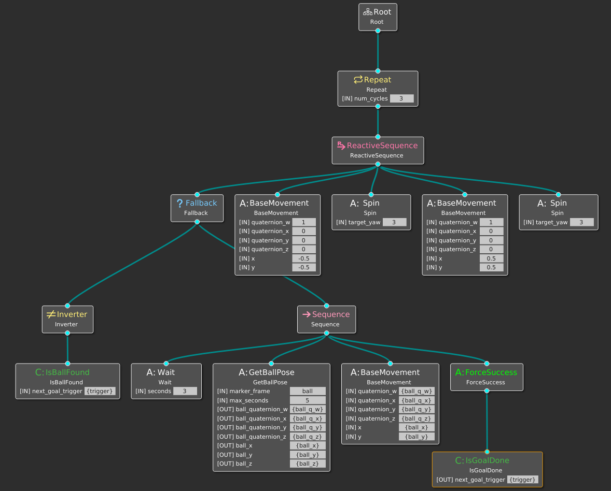

# Behavior Tree Coordinator
This package uses the IRAS/Common/BehaviorTree.ROS package which is a ROS2 wrapper around the [BehaviorTree.cpp](https://www.behaviortree.dev/) package.

The Coordinator defines the behavior trees with single BT actions.

The set of actions can be arranged freely with the graphical user interface [Groot](https://github.com/BehaviorTree/Groot).

## How to start

Start the docker container

    source start_docker.sh

Compile mounted package

    colcon build
    source install/setup.bash

Attach a new docker shell

    docker exec -it coordinator bash

Launch the Coordinator node with parameters

    ros2 launch behavior_tree_coordinator demo.launch.py
    
To view or modify the behavior trees (in a new docker shell)

    ros2 run groot Groot

To run only the image processing node for detecting red balls

    ros2 run behavior_tree_coordinator detect_balls_node.py

## Resources 

https://medium.com/@yasuhirachiba/converting-2d-image-coordinates-to-3d-coordinates-using-ros-intel-realsense-d435-kinect-88621e8e733a

